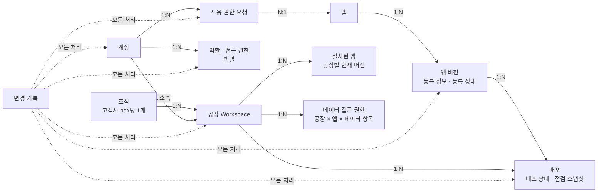

# pdx Factory AI OS 온보딩·배포 관리 MVP 통합 기획안

주제 A · 작성자 김윤주

## 목차

1. [요약](#1-요약)
2. [배경과 문제](#2-배경과-문제)
3. [사용자와 역할](#3-사용자와-역할)
4. [범위](#4-범위)
5. [해결 방향](#5-해결-방향)
6. [핵심 객체 구조](#6-핵심-객체-구조)
7. [책임 경계](#7-책임-경계)
8. [역할별 권한](#8-역할별-권한)
9. [핵심 흐름 상세](#9-핵심-흐름-상세)
   - [9-1. 앱 등록](#9-1-앱-등록)
   - [9-2. 검토와 승인](#9-2-검토와-승인)
   - [9-3. 대상 공장 선택과 배포 전 점검](#9-3-대상-공장-선택과-배포-전-점검)
   - [9-4. 설정 부족 해결](#9-4-설정-부족-해결)
   - [9-5. 배포 실행과 배포 상태](#9-5-배포-실행과-배포-상태)
   - [9-6. 상태 확인과 화면 구성](#9-6-상태-확인과-화면-구성)
10. [예외 상황](#10-예외-상황)
11. [계정과 사용 권한 요청](#11-계정과-사용-권한-요청)
12. [변경 기록](#12-변경-기록)
13. [성공 지표](#13-성공-지표)
14. [주요 결정과 근거](#14-주요-결정과-근거)
15. [후속 범위와 미결 사항](#15-후속-범위와-미결-사항)

> 표기: **[사실]** 과제·공개 자료에 적힌 것 / **[추정]** 여러 자료를 종합한 해석 / **[가정]** 근거 없이 세운 전제

---

## 1. 요약

- **문제:** Factory Group A는 앱마다 계정·권한·데이터 연결·배포 상태를 따로 관리해서 설정 누락, 버전 혼선, 승인 이력 부재가 반복된다.
- **해결:** Application Manager가 표준 등록 정보가 담긴 패치 파일로 앱 버전을 등록하면, Platform Admin이 pdx 한곳에서 검토·승인하고 공장별로 자동 점검한 뒤 배포한다. 모든 사용자는 공장별 상태를 pdx에서 확인하고, 모든 처리는 변경 기록으로 남는다.
- **MVP 범위:** 원프레딕트 앱 20개 × 공장 3곳 전부에 같은 절차를 적용한다. 고객사·외부 업체 앱과 중앙 등록·배포는 후속 범위다.
- **성공 기준:** 배포 전 설정 누락 발견율, 기록–실제 운영 버전 일치율, 충돌 배포 전 차단율, 변경 기록 완전성(목표 100%)으로 판단한다.
- **남은 결정:** 성공 지표의 기준선은 MVP 적용 후 첫 측정으로 확보한다.

## 2. 배경과 문제

### 현황

| 구분 | 내용 |
|---|---|
| [사실] | Factory Group A는 공장 3곳에서 AI application 20개(설비 진단, 품질 예측, 에너지 최적화 등)를 운영한다. |
| [사실] | 현재는 application마다 계정·권한·데이터 연결·배포 상태를 따로 관리한다. |
| [사실] | pdx와 cyclone은 온프레미스로 제공되고, 라이선스는 공장(Site) 단위다. |
| [사실] | pdx 위의 application은 cyclone이 정제한 데이터와 MxFM 모델을 공급받아 동작한다. |
| [사실] | 공개된 고객 사례는 발전·정유·화학 등 업종에 분포한다. |
| [사실] | application의 버전·의존성을 선언하고 해결하는 책임은 Application 팀에 있다. |

### 문제

공통 원인은 신규 AI application을 추가할 때 표준 절차가 없어서, 등록·검토·배포 방식이 팀마다 다르다는 것이다. 그 결과 세 가지 문제가 반복된다.

1. **설정 누락:** application별로 계정·권한·데이터 연결을 따로 설정하기 때문에 현황을 한곳에서 파악하지 못하고 누락·오설정이 잦다. 퇴사하거나 부서를 옮긴 사람의 계정이 앱마다 남아 있어서 접근을 제때 막지 못한다.
2. **버전 혼선:** 공장마다 서로 다른 버전이 배포돼 있어도 어떤 버전이 실제로 정상 동작 중인지 한곳에서 확인할 수 없다. 그래서 같은 업데이트가 어떤 공장에서는 되고 어떤 공장에서는 막히는 호환성 충돌이 생긴다.
3. **승인 이력 부재:** 누가 언제 무엇을 승인하고 배포했는지 기록이 남지 않아서 장애를 추적하거나 감사에 대응하기 어렵다. [추정] 규제 업종 고객에게는 감사 기록이 도입 조건일 수 있다.

### 용어

| 용어 | 뜻 |
|---|---|
| pdx | 원프레딕트의 AI Factory OS다. cyclone이 정제한 데이터와 MxFM 모델 위에서 application을 통합 관리한다. |
| cyclone | 원프레딕트의 제조 데이터·MLOps 플랫폼이다. pdx에 정제된 데이터를 공급한다. |
| MxFM | 원프레딕트의 제조 파운데이션 모델이다. application이 공급받아 쓴다. |
| 공장(Workspace) | 공장 1곳과 1:1로 대응하는 pdx의 관리 단위다. 라인·부서 단위로는 나누지 않는다. |
| 환경(실행 조건) | 공장이 가진 pdx 버전, MxFM 버전, 연결된 데이터다. |
| 등록 정보 | 앱 버전마다 적는 필요 데이터·필요 권한·호환 버전 등의 정보다. 패치 파일 안에 들어 있고 pdx가 자동으로 읽는다. |
| 의존성 | 앱 버전이 요구하는 실행 조건과 다른 앱이다. |
| 버전 / 릴리즈 / 배포 | 버전은 앱의 특정 판이다. 릴리즈는 그 버전을 등록 정보와 함께 pdx에 제출하는 것이다. 배포는 승인된 버전을 특정 공장에 설치하는 것이다. |
| 사용 권한 | 사람이 앱을 쓰는 권한이다(역할 기반). |
| 데이터 접근 권한 / 데이터 연결 | 데이터 접근 권한은 앱이 데이터를 읽도록 허락한 것이고, 데이터 연결은 그 허락에 따라 실제로 데이터가 이어진 상태다. |
| 배포 전 점검 | 등록 정보와 대상 공장의 실행 조건·권한·데이터 연결을 시스템이 비교해 부족한 항목을 표시하는 것이다. |
| 버전 충돌 / 설정 부족 | 배포 전 점검에서 배포가 막힌 사유다. 버전 검사가 실패하면 버전 충돌, 권한·데이터 연결 검사가 실패하면 설정 부족이다. |
| 선행 버전 | 공장이 업그레이드 조건을 만족하려면 먼저 설치해야 하는 버전이다. |
| 헬스체크 | 설치된 앱이 정상 실행 중인지 시스템이 확인하는 상태 점검 요청이다. |
| 변경 기록 | 등록·승인·배포·권한 처리마다 남는 감사용 기록이다. |

## 3. 사용자와 역할

과제의 세 사용자(페르소나)는 모두 1차 사용자다. pdx 안의 권한 묶음인 **역할(Role)** 은 사람과 따로 정의한다. 과제의 사람 이름을 그대로 역할 이름으로 쓰면 "누가 그 권한을 갖는가"가 헷갈리기 때문이다.

| 과제의 사용자 | 소속 | pdx 역할 | 하는 일 |
|---|---|---|---|
| Platform Admin | [가정] 고객사 운영 담당자 | Platform Admin | 조직·공장·계정·역할을 관리하고, 등록을 검토·승인하며, 배포 대상을 고르고 배포를 실행한다. 고객사 pdx 전체를 관리한다. |
| Application PM/Owner | [가정] 원프레딕트 앱 PM | Application Manager | 패치 파일로 앱 버전을 등록하고, 반려되면 보완해 재제출한다. 버전·의존성·릴리즈를 관리한다. |
| (같은 역할을 받을 수 있는 사람) | 고객사 IT 엔지니어 | Application Manager | 원프레딕트에서 받은 패치 파일을 대신 등록한다. |
| Plant Operator | [사실] 고객사 공장 현장 직원 | Plant Operator | 자기 공장에 배포된 앱의 상태를 확인하고, 앱을 쓰며, 아직 쓸 수 없는 앱의 사용 권한을 요청한다. |

- 한 계정은 역할 하나만 가진다. 역할이 바뀌면 Platform Admin이 변경하고, 변경 전 값과 변경 후 값이 변경 기록에 남는다.
- 역할은 계정마다 하나이고, 앱별로 필요한 만큼 부여하는 것은 접근 권한이다. 계정마다 권한을 따로 세분화하는 방식은 쓰지 않는다.
- 이 문서에서 "등록자"는 Application Manager를 가리킨다.

## 4. 범위

### 전제

- [가정] MVP는 Factory Group A의 온프레미스 pdx를 기준으로 하고, 폐쇄망에서도 성립하는 흐름을 기본으로 한다.
- [가정] 첫 버전의 application 팀은 원프레딕트 앱 제품 팀이다.
- [가정] Platform Admin은 고객사 운영 담당자다.
- [가정] 원프레딕트는 고객사의 배포 현황을 원격으로 보지 않는다.

### MVP에 포함

- 설정 누락: 계정·권한·데이터 연결의 누락과 오설정, 앱마다 남은 계정 때문에 접근을 제때 막지 못하는 문제
- 버전 혼선: 기록과 실제 운영 버전의 불일치, 업그레이드 경로 충돌
- 승인 이력 부재: 요청·승인·실행·반영 시점의 기록
- Plant Operator의 사용 권한 요청과 Platform Admin의 부여·거절·제한
- 앱 20개 × 공장 3곳의 모든 조합에 같은 등록·검토·배포 절차 적용

### MVP에서 제외

| 제외 항목 | 이유 |
|---|---|
| CI/CD 엔진 구현, 컨테이너 오케스트레이션, 서버 구축, 과금·계약 설계 | 과제가 제외한 범위다. |
| 고객사 자체 앱, 외부 업체 앱 | 등록 기준과 승인 절차를 한 갈래로 유지해 MVP를 좁힌다. |
| 중앙 등록·배포(원프레딕트 중앙 시스템에서 여러 고객사로 배포) | 폐쇄망에서는 중앙에서 받아 올 수 없고, 중앙 계정과 고객사 서버 계정이 서로 다른 시스템이다. 5장 "검토한 대안"에 자세히 적었다. |
| 여러 고객사의 릴리즈 현황을 원프레딕트가 한곳에서 보는 기능 | 중앙 등록·배포가 있어야 가능하다. |
| 공장별 관리자 역할 | 과제의 세 역할을 유지한다. 관리자를 조직 전체와 공장별로 나누지 않는다. |
| 협력사 임시 배포 권한 | 폐쇄망이 막는 것은 실행이 아니라 반입이다. 계정별 권한 세분화는 MVP에서 뺐다. |
| 인사 정보 연동, 현장 시험 라인 검증 | 과제 문제의 핵심이 아니다. 개발·시험 검증은 원프레딕트가 등록 전에 끝낸다. |
| 고객사 IT 엔지니어가 받은 반려 사유를 원프레딕트에 전달하는 일 | pdx 밖에서 일어나는 일이다. |
| 공장 등록·수정 화면과 계정 생성 화면 | 규칙은 정했지만 이번 과제의 화면 범위에서는 뺐다. |

## 5. 해결 방향

### 핵심 방식

Application Manager가 표준 등록 정보로 앱을 등록하면 Platform Admin이 pdx 한곳에서 검토·배포하고, 모든 사용자가 공장별 상태를 확인한다. 이렇게 해서 설정 누락, 버전 혼선, 승인 이력 부재를 없앤다. 원프레딕트가 이 표준 절차를 제공한 결과, 고객사는 새 버전을 더 빠르고 안전하게 받는다.

| 장치 | 푸는 문제 |
|---|---|
| 패치 파일 안 등록 정보 자동 읽기 | 등록 단계의 설정 누락 |
| pdx 공통 계정과 역할 기반 접근 제어(RBAC) | 앱마다 계정을 따로 만들어 생기는 누락, 접근 제한 지연 |
| 업그레이드 가능한 이전 버전 선언과 공장별 현재 버전 비교 | 업그레이드 경로 충돌 |
| 등록 정보와 공장 실행 조건·권한·데이터 연결의 자동 비교 | 배포 전 설정 누락, 호환성 충돌 |
| 실제 정상 동작을 확인해야 완료로 보는 배포 상태 | 기록과 실제 운영 버전의 차이 |
| 공장별 배포 현황 | 버전 혼선 |
| 변경 기록 자동 생성 | 승인 이력 부재 |

운영 원칙은 다음과 같다.

- 모든 설치와 변경은 pdx 배포로만 한다. pdx를 거치지 않은 설치는 허용하지 않는다.
- 버전 충돌이나 설정 부족이 발견되면 경고에서 멈추지 않고 배포를 막는다.
- 설치 명령을 보낸 것이 아니라 실제 정상 동작을 확인해야 배포 완료로 본다.

### 메인 시나리오

1. Application Manager(예: 현장의 원프레딕트 PM)가 application의 새 버전 패치 파일을 올리면 pdx가 등록 정보를 자동으로 읽는다.
2. Platform Admin이 내용을 검토하고 승인하면 등록이 확정된다.
3. Platform Admin이 배포할 공장을 고른다.
4. pdx가 등록 정보와 공장의 실행 조건·권한·데이터 연결을 자동으로 비교하고, Platform Admin은 부족한 항목만 채운다.
5. Platform Admin이 배포를 실행하면 해당 공장에 설치되고, pdx가 정상 동작을 확인한다.
6. pdx 계정을 가진 모든 사용자가 상태를 확인한다. Plant Operator는 기존 사용 권한으로 확인한다. 배포된다고 사용 권한이 자동으로 붙지는 않는다.

### 예외 시나리오 (과제 요구: 예외 2개 이상)

1. Application Manager가 같은 application의 v2.0.1을 등록하면 pdx가 등록 정보를 읽고 검토를 기다린다.
2. Platform Admin이 검토 중에 반려한다(**승인 반려**). 등록자는 pdx에서 반려 사유를 보고 고친 패치 파일로 다시 제출한다.
3. Platform Admin이 공장 A(현재 v1.1.1)와 공장 B(현재 v1.0.3)를 고르면, pdx가 선언된 업그레이드 가능 이전 버전(v1.1 이상)과 공장별 현재 버전을 비교한다.
4. 공장 B는 조건에 맞지 않으므로 pdx가 공장 B의 배포를 막고 선행 버전을 안내한다(**버전 충돌**). 공장 A는 영향 없이 배포를 계속한다.

처리 규칙의 상세는 10장에 정리했다.

### 업무 흐름 전후 비교

| 단계 | 현재 | 적용 후 |
|---|---|---|
| 1. 등록 | 등록 절차가 앱 팀마다 다르다. | 어느 앱이든 pdx라는 공통 경로로 패치 파일을 올려 등록한다. |
| 2. 검토·승인 | 누가 언제 승인했는지 기록이 남지 않는다. | Platform Admin이 한 번 검토·승인하고 pdx가 기록을 남긴다. |
| 3. 대상 공장 선택 | 공장마다 버전이 섞여 같은 업데이트가 일부 공장에서 막힌다. | Platform Admin이 pdx에서 대상 공장을 고르고, 막히는 공장은 미리 드러난다. |
| 4. 설정·권한 확인 | 앱마다 계정·권한·데이터 연결을 따로 설정해 누락이 생긴다. | pdx가 자동으로 비교하고 Platform Admin은 부족한 것만 채운다. |
| 5. 배포 | 배포 절차가 앱 팀마다 다르다. | 모든 앱을 같은 절차로 배포한다. |
| 6. 상태 확인 | 어떤 버전이 정상 동작 중인지 한곳에서 확인할 수 없다. | 모든 사용자가 pdx에서 공장별 상태와 정상 동작 여부를 본다. |

### 검토한 대안: 중앙 등록·배포

원프레딕트 중앙 시스템에서 여러 고객사로 등록·배포하는 방식을 검토했지만 선택하지 않았다.

- **선택하지 않은 이유:** 폐쇄망에서는 중앙에서 받아 올 수 없다. 온프레미스에서는 중앙 시스템 계정과 고객사 서버 계정이 서로 다른 시스템의 계정이다.
- **감수하는 한계:** 원프레딕트가 여러 고객사의 릴리즈 현황을 한곳에서 볼 수 없다. 이 한계는 중앙 등록·배포를 도입할 때 푼다.
- **그래도 되는 이유:** 과제의 문제는 Factory Group A 안의 버전 혼선이다. 중앙 등록이 없어도 등록과 버전·의존성 관리는 성립한다.

## 6. 핵심 객체 구조

### 관계 규칙

- 조직은 고객사 pdx마다 하나이며 pdx를 설치할 때 만들어진다. 모든 사용자는 조직 정보를 볼 수 있고, 이름 같은 조직 정보는 Platform Admin만 수정한다.
- 조직은 여러 공장을 가진다. 공장 1곳은 Workspace 1개와 1:1로 대응한다.
- 앱은 여러 버전을 가진다. 배포는 하나의 버전을 하나의 공장에 설치한 것이다. 그래서 버전 하나에 공장 수만큼 배포가 생긴다(1:N).
- 한 사용자는 공장 하나에 소속된다. Platform Admin은 소속과 관계없이 모든 공장을 관리한다.
- 공장의 등록·수정·삭제는 Platform Admin만 한다. 배포 이력이 있는 공장은 삭제하지 않고 비활성화한다. 비활성화된 공장의 배포 현황과 변경 기록은 계속 볼 수 있지만, 배포 대상으로는 고를 수 없다.

### 관리 대상 정보

| 대상 | 관리하는 정보 | 누가 채우나 |
|---|---|---|
| 앱 버전 | 앱 ID, 버전, 필요 데이터, 필요 권한, 호환 버전(pdx 범위·MxFM 버전), 업그레이드 가능한 이전 버전, 릴리즈 노트, 등록 상태, 반려 사유 | 패치 파일에서 자동으로 읽는다. 상태와 사유는 검토 결과로 정해진다. |
| 환경(공장) | pdx 버전, MxFM 버전, 설치된 앱과 현재 버전, 활성 여부 | 시스템과 Platform Admin |
| 데이터 접근 권한 | 공장, 앱, 데이터 항목, 부여자, 부여 시각 | Platform Admin |
| 배포 | 버전, 공장, 배포 상태, 실패 사유, 실행 직전 점검 결과 스냅샷 | 시스템(실행은 Platform Admin) |
| 사용 권한 요청 | 요청자, 대상 앱, 공장(요청자 소속), 사유, 처리 상태, 거절 사유 | Plant Operator·Application Manager가 요청하고 Platform Admin이 처리한다. |
| 변경·감사 이력 | 12장 참고 | 시스템이 자동으로 남긴다. |
| 점검 로그 | 점검 시각, 버전과 공장, 결과, 부족한 항목 | 시스템(지표 집계 전용, 화면에 보이지 않음) |

## 7. 책임 경계

제품 전역 정책(지원 버전, 호환 규칙, 배포 방식)은 원프레딕트가 정하고, 고객사 내부 운영 정책은 Platform Admin이 정한다. 이 원칙에 따라 AI Factory OS(pdx), application(앱 팀), 고객 설정(Platform Admin)의 책임을 나눈다.

### 책임 범위 요약

| 주체 | 책임지는 것 | 책임지지 않는 것 |
|---|---|---|
| AI Factory OS (pdx) | 모든 앱에 같은 등록·검토·배포 절차를 제공한다. 등록 정보를 읽어 형식을 검증하고, 선언된 조건과 공장 실행 조건을 비교해 맞지 않으면 배포를 막는다. 설치 후 정상 동작을 확인하고, 모든 처리를 기록한다. | 등록 정보의 내용이 맞는지 판단하지 않는다. 의존성 문제를 대신 해결하지 않는다. 배포할 공장과 시점을 정하지 않는다. 실패한 배포를 자동으로 재시도하지 않는다. |
| application (원프레딕트 앱 팀) | 등록 정보의 내용과 의존성 선언이 정확한지 책임진다. pdx가 요구하는 인터페이스(아래)를 지킨다. 반려·실패의 원인을 고쳐 다시 제출한다. | 어느 공장에 언제 배포할지 정하지 않는다. 고객사의 계정·권한·데이터 연결을 설정하지 않는다. 고객사 pdx의 배포 현황을 원격으로 보지 않는다. |
| 고객 설정 (Platform Admin) | 무엇을 어느 공장에 들일지 결정한다(승인·반려, 대상 선택, 실행). 공장·계정·역할·접근 권한과 공장별 데이터 연결을 관리한다. | 등록 정보를 고치지 않는다. pdx의 점검 기준과 정상 동작 기준을 바꾸지 않는다. pdx를 거치지 않고 설치하지 않는다. |

### application이 지켜야 할 인터페이스

| 인터페이스 | 요구 수준 |
|---|---|
| 패치 파일 | 표준 등록 정보(9-1 항목과 형식)를 파일 안에 담아 제공한다. 사람이 pdx 화면에서 옮겨 적지 않는다. |
| 헬스체크 | pdx의 헬스체크 요청에 10초 안에 성공 응답을 보낸다. 설치 후 30분 안에 3회 연속 성공해야 정상 동작으로 인정된다. |
| 데이터 수신 | 등록 정보에 선언한 데이터 항목을 cyclone을 통해 받는다. 실제 수신이 시작돼야 정상 동작으로 인정된다. |

### 제품 표준과 고객 설정의 경계

고객사마다 달라도 되는 것만 고객 설정으로 열고, 절차와 판정 기준은 제품 표준으로 고정한다. 판정 기준이 고객사마다 다르면 같은 앱 버전의 배포 가능 여부가 고객사마다 달라져서, 표준 절차로 버전 혼선을 막는다는 목적이 무너지기 때문이다.

| 구분 | 항목 |
|---|---|
| 제품 표준 (고객이 바꿀 수 없음) | 등록 정보 항목과 형식, 버전 규칙 / 등록 상태와 배포 상태의 단계 / 배포 전 점검 항목(①~⑤)과 순서 / 정상 동작 기준(30분, 10초, 3회 연속, 데이터 수신) / 역할 3개와 역할별 권한 범위 / 변경 기록 대상·항목과 최소 보관 기간 1년 |
| 고객 설정 (고객사마다 다름) | 공장 구성(등록·비활성화) / 계정과 앱별 역할·접근 권한 / 공장별 데이터 접근 권한과 데이터 연결 / 어느 버전을 어느 공장에 언제 배포할지 / 변경 기록 보관 기간 연장 |
| 고객 설정이지만 MVP에 없음 (후속) | 운영 시간 중 배포 허용 여부, 공장별 자동 배포 금지, 공장별 관리자 지정. MVP는 모든 배포를 Platform Admin이 직접 실행하므로 이 설정 없이도 고객이 배포 시점을 통제할 수 있다. |

### 흐름 단계별 책임

| 영역 | AI Factory OS (pdx 공통 기능) | application (원프레딕트 앱 팀) | 고객 설정 (Platform Admin) |
|---|---|---|---|
| 등록 정보 | 선언 칸(표준 항목)을 제공하고, 패치 파일에서 자동으로 읽어 형식과 버전 규칙을 검증한다. | 등록 정보의 내용과 의존성 선언을 정확하게 작성한다. 고객사 담당자가 파일을 반입만 해도 내용 책임은 앱 팀에 있다. | 패치 파일을 반입하고 올린다(고객사 IT 엔지니어가 직접 패치 파일을 등록하는 경우에만). |
| 검토·승인 | 승인 대기 목록, 자기 제출 건 승인 금지, 동시 처리 방지, 반려 사유 전달을 제공한다. | 반려되면 원인을 고친 패치 파일로 재제출한다. | 형식이 아닌 내용(변경 내용, 호환 버전과 업그레이드 경로, 필요 데이터·권한)을 검토하고 승인·반려한다. |
| 호환성·의존성 | 선언된 조건과 공장 실행 조건을 비교하고, 선행 업데이트를 안내하며, 조건에 맞지 않으면 배포를 막는다. | 호환 버전, 업그레이드 가능한 이전 버전, 다른 앱 의존성을 선언하고 해결한다. | 막힌 공장에 선행 버전을 먼저 배포한다. |
| 권한·데이터 연결 | 필요 권한과 데이터 연결 여부를 cyclone 커넥터로 확인해 부족한 항목을 보여 준다. | 앱이 요구하는 데이터 항목과 권한을 선언한다. | 공장에 필요한 권한을 부여하고 데이터를 연결한다. |
| 배포 | 설치, 헬스체크·데이터 수신으로 정상 동작 확인, 실패 시 이전 버전 유지, 실패 알림을 맡는다. | 배포가 실패하면 원인을 고친 새 버전을 등록한다. | 배포할 공장을 고르고 배포를 실행한다. |
| 조직·공장·계정 | 공통 계정과 역할 기반 접근 제어를 제공하고, 권한 변경을 즉시 반영한다. | (해당 없음) | 공장 등록·비활성화, 계정 생성·비활성화, 역할·접근 권한 부여와 회수, 사용 권한 요청 처리를 맡는다. |
| 기록 | 변경 기록을 자동으로 남기고, 수정·삭제를 막으며, 기본 1년 이상 보관한다. | (해당 없음) | 업종 규정에 따라 보관 기간을 늘린다(줄일 수는 없다). 변경 기록을 조회한다. |

## 8. 역할별 권한

`C` 만들기(등록·제출·부여·실행) · `R` 보기 · `U` 바꾸기(재제출·처리·채우기) · `D` 없애기(비활성화·회수) · `-` 권한 없음

| 대상 | Platform Admin | Application Manager | Plant Operator |
|---|---|---|---|
| 조직 | RU | R | R |
| 공장 | CRUD (배포 이력이 있으면 삭제 대신 비활성화) | R | R (자기 공장) |
| 계정 | CRUD (D = 비활성화) | R (본인) | R (본인) |
| 역할·접근 권한 | CRUD (D = 회수) | R (본인) | R (본인) |
| 앱 버전 등록 | CRU | CRU (등록 권한을 받은 앱) | - |
| 등록 결정(승인·반려) | CR (자기 제출 건 제외) | R (자기 제출 건의 결과·사유) | - |
| 배포(대상 선택·점검·실행) | CRU (U = 설정 부족 채우기) | R (등록 권한을 받은 앱, 모든 공장) | R (자기 공장) |
| 앱 사용 | R (모든 앱) | R (사용 권한을 받은 앱) | R (사용 권한을 받은 앱) |
| 사용 권한 요청 | RU (U = 승인·거절) | CR (자기 요청) | CR (자기 요청) |
| 변경 기록 | R | - | - |

- Platform Admin은 고객사 pdx의 모든 기능을 쓸 수 있다. 원프레딕트가 원격으로 쓰는 기능(중앙 등록 등)은 여기에 포함하지 않는다.
- Application Manager와 Plant Operator는 다음을 할 수 없다: 조직 정보 수정, 계정·역할·접근 권한 관리, 공장 등록·수정·삭제·비활성화, 등록 승인·반려, 배포 대상 선택·점검·실행, 사용 권한 요청 승인·거절, 변경 기록 조회.
- 권한 밖의 조회(예: Plant Operator가 다른 공장의 배포 현황을 여는 것, Application Manager가 등록 권한이 없는 앱의 현황을 여는 것)는 시스템이 거부한다.

## 9. 핵심 흐름 상세

과제의 핵심 흐름 순서(앱 등록 → 검토·승인 → 대상 Workspace 선택 → 설정·권한 확인 → 배포 → 상태 확인)를 따른다. 각 절은 "누가 무엇을 하는지", "규칙", "화면 동작" 순서로 적는다.

### 9-1. 앱 등록

Application Manager가 앱의 새 버전을 패치 파일로 등록한다. 신규 앱의 첫 등록과 기존 앱의 버전 업데이트는 같은 절차다.

**규칙**

- 등록 정보는 패치 파일 안에 들어 있고 시스템이 자동으로 읽어 채운다. 사람은 pdx 화면에서 등록 정보를 입력하거나 고치지 않는다.
- 등록 정보 항목은 다음과 같다.

| 항목 | 필수 | 형식·조건 |
|---|---|---|
| 앱 ID | 필수 | 영문 소문자·숫자·하이픈, 3~40자, 고객사 pdx 안에서 유일 |
| 버전 | 필수 | major.minor.patch(Semantic Versioning), 같은 앱 안에서 유일 |
| 필요 데이터 | 필수(0개 이상) | 앱이 받을 cyclone 데이터 항목 목록 |
| 필요 권한 | 필수(0개 이상) | 앱이 요구하는 데이터 접근 권한 목록 |
| 호환 버전 | 필수 | 지원하는 pdx 버전 범위 1개 이상과 요구하는 MxFM 버전. MxFM을 쓰지 않으면 0.0.0 |
| 업그레이드 가능한 이전 버전 | 필수 | 이 버전으로 올라올 수 있는 최소 버전. 앱의 첫 버전이면 없음 |
| 릴리즈 노트 | 선택 | 2,000자 이내 |

- 버전 규칙: 새 버전은 같은 앱에서 이미 승인된 가장 높은 버전보다 높아야 한다. 업그레이드 가능한 이전 버전은 같은 앱에서 이미 승인된 버전이어야 하고, 새 버전보다 낮아야 한다(앱의 첫 버전이면 적용하지 않는다).
- 필수 항목이 빠졌거나, 형식이 맞지 않거나, 버전 규칙을 어기면 등록을 받지 않는다. 이 등록은 승인 대기 상태가 되지 않는다.
- 이미 승인된 앱 ID·버전 조합은 다시 등록할 수 없다. 승인된 버전을 고치려면 새 버전으로 등록한다.
- 통과한 등록은 승인 대기 상태로 저장된다. 같은 앱의 여러 버전이 동시에 승인 대기일 수 있다.

**화면 동작:** 앱 버전 관리 화면에서 파일을 올리면 "승인 대기로 등록됨" 또는 거부 사유(어긋난 항목·버전 규칙)를 보여 준다. 읽어 온 등록 정보는 수정할 수 없는 형태로 그대로 보여 준다.

### 9-2. 검토와 승인

Platform Admin이 승인 대기 중인 등록을 검토하고 승인하거나 반려한다.

**규칙**

- 승인·반려는 Platform Admin만 한다. 자신이 제출한 등록은 승인할 수 없다.
- 형식은 등록할 때 시스템이 이미 검증했으므로, Platform Admin은 내용(변경 내용, 호환 버전과 업그레이드 경로, 필요 데이터·권한)을 검토한다.
- 반려할 때는 사유를 반드시 입력해야 한다. 반려 결과와 사유는 그 등록을 제출한 사람이 pdx 안에서 본다.
- 재제출할 때는 등록 정보 전체(고친 패치 파일)를 다시 제출한다. 재제출하면 승인 대기로 돌아간다.
- 승인·반려는 승인 대기 상태의 등록에만 할 수 있다. 다른 Platform Admin이 먼저 처리한 등록에는 다시 처리할 수 없고, 먼저 처리된 결과가 유지된다.

**등록 상태** (버전마다 하나)

| 상태 | 뜻 | 다음 상태 |
|---|---|---|
| 승인 대기 | 제출됐고 Platform Admin의 결정을 기다린다. | 승인하면 승인됨, 반려하면 반려 |
| 반려 | 사유와 함께 돌려보냈다. | 재제출하면 승인 대기 |
| 승인됨 | 등록이 확정돼 배포 대상으로 고를 수 있다. | 종료 상태. 승인을 취소하거나 되돌릴 수 없고, 문제가 있으면 새 버전을 등록한다. |

**화면 동작:** 앱 버전 관리 화면에서 승인하면 상태가 승인됨으로 바뀐다. 반려를 고르면 사유 입력 칸이 필수로 열린다. 승인 대기가 아닌 등록에서는 승인·반려 버튼이 비활성화되고, 다른 관리자가 먼저 처리해 요청이 거부되면 그 사실을 안내한다.

### 9-3. 대상 공장 선택과 배포 전 점검

Platform Admin이 승인된 버전을 배포할 공장을 고르면, 시스템이 공장마다 배포 전 점검을 한다.

**규칙**

- 앱 팀이 등록 정보에 선언한 조건을 대상 공장마다 다음 순서로 검사한다.

| 순서 | 검사 | 통과 조건 | 실패 시 사유 |
|---|---|---|---|
| ① | pdx 버전 | 공장의 pdx 버전이 등록 정보의 지원 범위 안에 있다. | 버전 충돌 |
| ② | MxFM 버전 | 등록 정보와 공장의 MxFM 버전이 major.minor까지 같다. 0.0.0이면 건너뛴다. | 버전 충돌 |
| ③ | 업그레이드 경로 | 공장에 설치된 이 앱의 버전이 업그레이드 가능한 이전 버전 이상이다. 공장에 이 앱이 없으면 통과한다. | 버전 충돌 |
| ④ | 권한 | 필요 권한이 공장에 모두 부여돼 있다. | 설정 부족 |
| ⑤ | 데이터 연결 | 필요 데이터 항목이 모두 실제로 연결돼 있다. | 설정 부족 |

- 버전 검사(①~③)는 하나라도 실패하면 그 자리에서 멈춘다. 설정 검사(④⑤)는 모두 실행해서 부족한 항목을 한 번에 보여 준다.
- 데이터 연결은 항목마다 cyclone 커넥터에 확인하고, 30초 안에 응답이 없으면 그 항목은 연결되지 않은 것으로 본다.
- 검사는 공장마다 독립적이다. 한 공장이 실패해도 다른 공장의 검사와 배포는 계속된다.
- 점검 결과는 화면에 보여 주는 임시 결과이며 배포 이력으로 저장하지 않는다. 점검만으로는 배포 이력이 생기지 않는다.
- 대신 점검이 끝날 때마다 점검 시각, 버전과 공장, 결과, 부족한 항목을 **점검 로그**로 남긴다. 점검 로그는 성공 지표 집계용이며 배포 이력·변경 기록이 아니고 화면에 보이지 않는다.

**화면 동작:** 앱 버전 관리 화면에서 승인된 버전의 '배포하기'를 누르면 그 버전이 선택된 채 배포 관리 화면이 열린다. 공장을 고르면 공장별 결과(통과 / 버전 충돌 / 설정 부족)가 표시되고, 버전 충돌이면 필요한 선행 버전과 해결 방법을 함께 보여 준다.

### 9-4. 설정 부족 해결

Platform Admin이 설정 부족으로 표시된 항목을 채운다.

**규칙**

- 설정 부족 항목은 Platform Admin만 채울 수 있다. 필요 권한을 부여하거나 필요 데이터를 연결하는 방식으로 채운다.
- 채우면 시스템이 검사를 다시 실행하고, 모두 통과해야 그 조합의 배포 실행을 허용한다.

**화면 동작:** 배포 관리 화면의 점검 결과 영역에서 부족한 항목을 입력하고 재검사 결과를 바로 확인한다.

### 9-5. 배포 실행과 배포 상태

Platform Admin이 점검을 통과한 조합의 배포를 실행하면, 시스템이 설치하고 정상 동작을 확인해 상태를 갱신한다.

**규칙**

- 배포 실행은 Platform Admin만 한다. 공장에 대한 모든 설치와 변경은 pdx 배포로만 한다.
- 같은 앱을 같은 공장에 배포하는 중(설치 중·동작 확인 중)이면 그 조합에 새 배포를 시작할 수 없다.
- Platform Admin이 실행을 확인한 순간 배포 이력이 만들어진다. 이때 실행 직전의 점검 결과를 스냅샷으로 함께 저장한다. 스냅샷에는 검사 ①~⑤마다 통과 여부와 비교한 두 값(등록 정보의 값, 공장의 현재 값)이 들어간다.
- **정상 동작 기준:** 설치 완료 후 30분 안에, 설치된 앱이 헬스체크 요청에 10초 안에 성공 응답을 3회 연속 보내고 선언한 데이터를 실제로 받기 시작한 것이 확인되면 정상 동작으로 인정한다.

**배포 상태** (승인된 버전 × 공장 조합마다 하나)

| 상태 | 뜻 | 다음 상태 |
|---|---|---|
| 설치 중 | 설치가 진행된다. | 끝나면 동작 확인 중, 실패하면 실패 |
| 동작 확인 중 | 정상 동작을 확인한다. | 기준을 만족하면 완료, 기한 안에 확인되지 않으면 실패 |
| 완료 | 정상 동작이 확인됐다. | 종료 상태 |
| 실패 | 설치 또는 동작 확인이 실패했다. | 종료 상태 |

**화면 동작:** 배포 관리 화면이 설치 중 → 동작 확인 중 → 완료 또는 실패와 실패 사유를 차례로 보여 준다. 실패 처리는 10장에 정리했다.

### 9-6. 상태 확인과 화면 구성

모든 사용자가 자기 권한 범위 안에서 배포 현황을 확인한다.

| 사용자 | 보는 범위 | 화면 |
|---|---|---|
| Platform Admin | 모든 공장의 배포 현황(버전 × 공장 단위) | 배포 관리, 공장 화면(모든 공장) |
| Application Manager | 자신이 등록 권한을 받은 앱의 모든 공장 배포 현황 | 앱 버전 관리 |
| Plant Operator | 자기 공장에 배포된 앱의 상태 | 공장 화면(자기 공장) |

**화면 구성:** 등록 상태와 배포 상태는 관리 단위가 다르므로(버전 하나 : 공장 여러 곳) 두 메뉴로 나눈다.

- **앱 버전 관리:** 등록 상태(승인 대기·반려·승인됨)와 등록·검토 작업을 다룬다. 승인된 버전 상세에는 공장별 배포 상태 요약을 보여 준다.
- **배포 관리:** 배포 상태(설치 중·동작 확인 중·완료·실패)와 대상 선택·점검·실행을 다룬다.
- 두 메뉴는 승인된 버전의 **'배포하기'** 버튼(버전이 선택된 채로 배포 관리로 이동)과 버전 상세의 배포 상태 요약으로 이어진다.
- **공장 화면:** 공장을 고르면 설치된 앱과 앱별 배포 상태를 보여 주는 조회 화면이다. 모든 역할이 함께 쓰며, 배포 조작은 배포 관리에서만 한다.
- **권한 관리:** 계정·역할·접근 권한을 관리하고, '사용 권한 요청' 탭에서 요청을 승인·거절한다.
- **변경 기록:** Platform Admin 전용 조회 화면이다(12장).

## 10. 예외 상황

| 예외 | 언제 생기나 | 시스템 동작 | 해결 방법 |
|---|---|---|---|
| 등록 거부 | 패치 파일의 등록 정보가 빠졌거나 형식·버전 규칙에 어긋날 때, 또는 이미 승인된 앱 ID·버전일 때 | 등록을 받지 않고 어긋난 항목을 표시한다. 승인 대기가 되지 않는다. | 앱 팀이 패치 파일을 고쳐 다시 올린다. |
| **승인 반려** | Platform Admin이 내용 검토에서 부적합하다고 판단할 때 | 사유를 필수로 받고 반려 상태로 바꾼다. 제출자가 pdx 안에서 사유를 본다. | 등록자가 고친 패치 파일 전체를 재제출하면 승인 대기로 돌아간다. |
| **버전 충돌** | 점검 ①~③(pdx 버전, MxFM 버전, 업그레이드 경로)이 실패할 때 | 그 공장의 배포를 막고, 업그레이드 경로 충돌이면 필요한 선행 버전을 안내한다. 다른 공장은 영향이 없다. | Platform Admin이 선행 버전을 먼저 배포한 뒤, 원래 버전의 점검부터 다시 한다. |
| **설정 부족(권한 부족)** | 점검 ④⑤(권한, 데이터 연결)가 실패할 때 | 부족한 항목을 모두 한 번에 표시하고 배포를 막는다. | Platform Admin이 권한 부여·데이터 연결로 채우면 재검사를 통과한 뒤 실행할 수 있다. |
| **배포 실패** | 설치가 실패하거나, 30분 안에 정상 동작이 확인되지 않을 때 | 상태를 실패로 바꾸고 그 공장에 있던 이전 버전을 그대로 유지한다. 자동으로 재시도하지 않는다. Platform Admin과 그 버전의 등록자에게 pdx 안에서 알린다(메일·문자 같은 외부 알림은 보내지 않는다). | 같은 버전을 같은 공장에 다시 실행할 수 없다. 앱 팀이 원인을 고친 새 버전을 등록해 검토부터 다시 거친다. |
| 동시 처리 | 여러 Platform Admin이 같은 등록이나 사용 권한 요청을 동시에 처리할 때, 같은 앱·공장에 배포가 진행 중일 때 | 먼저 처리된 결과를 유지하고 뒤의 요청은 거부한다. 진행 중인 배포가 있으면 새 배포를 막는다. | 화면이 "다른 관리자가 이미 처리했다"고 안내한다. |

**알림 표시:** 배포 실패는 헤더 알림함에 표시되고, 누르면 해당 배포 상세로 이동한다. 실패한 배포가 있는 동안 배포 관리 화면 상단 배너에 표시된다. 점검에서 막힌 것(버전 충돌·설정 부족)은 알림이나 배너로 보내지 않고 배포 관리 화면의 점검 결과 영역에만 표시한다.

## 11. 계정과 사용 권한 요청

### 계정과 접근 권한

- 모든 사용자는 pdx 공통 계정 하나로 모든 앱에 접근한다. 앱마다 다른 것은 역할과 권한뿐이다.
- 계정 생성과 비활성화는 Platform Admin만 한다.
- Platform Admin은 사용자에게 역할 하나를 정해 주고, 앱별로 접근 권한을 부여한다.
- 부서 이동처럼 일부 접근만 막을 때는 앱별로 권한을 제한하고, 퇴사처럼 전체 차단이 필요할 때는 계정을 비활성화한다.
- 권한 제한과 계정 비활성화는 즉시 효력이 있으며, 이미 로그인한 세션에도 바로 적용된다.
- 비활성화된 계정은 삭제하지 않으며, 그 계정이 남긴 변경 기록은 그대로 보존한다.
- Application Manager와 Plant Operator는 자기 계정 정보와 역할·접근 권한을 볼 수만 있다.

### 사용 권한 요청

Plant Operator(또는 Application Manager)가 아직 쓸 수 없는 앱의 사용 권한을 요청하고, Platform Admin이 승인하거나 거절한다.

- 요청할 때는 대상 앱과 요청 사유를 입력한다. 공장은 요청자의 소속 공장으로 정해진다.
- 같은 사람이 같은 앱에 처리 대기 중인 요청을 가지고 있으면 새 요청을 낼 수 없다.
- Platform Admin이 승인하면 그 즉시 해당 앱의 사용 권한이 부여된다. 별도 단계는 없다.
- 거절할 때는 사유를 반드시 입력해야 한다.
- 승인·거절은 처리 대기 상태의 요청에만 할 수 있다. 먼저 처리된 요청에는 다시 처리할 수 없다.
- 요청자는 pdx 안에서 자기 요청의 결과와 사유를 확인한다. 외부 알림은 보내지 않는다.
- 화면: 요청자는 공장 화면에서 권한이 없는 앱을 눌러 요청하고, 그 앱 행에서 요청 대기·거절됨(사유 보기)을 바로 확인한다. Platform Admin은 권한 관리의 '사용 권한 요청' 탭에서 처리한다.

## 12. 변경 기록

### 기록 대상

시스템은 다음 처리가 일어날 때마다 변경 기록을 자동으로 남긴다.

- 등록 요청·재제출, 승인, 반려
- 배포 실행, 반영(완료), 실패
- 역할·접근 권한 부여와 제한, 계정 생성과 비활성화
- 공장 등록·수정·삭제·비활성화
- 사용 권한 요청 승인·거절
- 변경 기록 조회(조회자와 조회 시각)

### 기록 항목

- 요청자, 승인자, 실행자(처리자), 처리 시각과 반영 시점
- 대상(앱·버전·공장 또는 계정)
- 변경 전 값과 변경 후 값(역할·접근 권한, 계정 상태, 등록 상태, 배포 상태, 사용 권한 요청 상태)
- 처리 결과, 반려·거절·제한일 때 그 사유
- 배포 실행이면 실행 당시 점검 결과 스냅샷

### 조회와 보관

- 변경 기록은 Platform Admin만 조회할 수 있다. 변경 기록 화면은 기간·공장·앱·행위자·행위 유형 필터를 제공하고, 조건에 맞는 기록이 없으면 빈 결과 상태를 보여 준다.
- 변경 기록은 누구도 수정하거나 삭제할 수 없다.
- 기본 보관 기간은 최소 1년이다. 고객사 업종 규정이 더 긴 기간을 요구하면 Platform Admin이 늘릴 수 있고, 줄일 수는 없다.

## 13. 성공 지표

발생 건수는 앱 팀이 잘 만들면 0건일 수 있어서 제품 효과를 보여 주지 못한다. 그래서 모든 지표를 비율로 잰다.

| 해결할 문제 | 성공 지표 | 정의 | 목표 |
|---|---|---|---|
| 설정 누락 | 배포 전 설정 누락 발견율 | 배포 전 점검에서 찾은 계정·권한·데이터 연결 누락 ÷ 전체 누락(배포 후 발견분 포함) | 기준선 확보 후 결정 |
| 버전 혼선 | 기록–실제 운영 버전 일치율 | pdx에 기록된 버전과 실제 정상 동작 중인 버전이 같은 공장·앱 조합 ÷ 전체 공장·앱 조합 | 기준선 확보 후 결정 |
| 버전 혼선 | 충돌 배포 전 차단율 | 배포 전에 잡은 호환·업그레이드 경로 충돌 ÷ 전체 충돌(배포 후 발견분 포함) | 기준선 확보 후 결정 |
| 승인 이력 부재 | 변경 기록 완전성 | 요청자·승인자·실행자·반영 시점이 모두 남은 배포 ÷ 전체 배포 | 100% |

- 발견율과 차단율의 분자는 점검 로그에서 집계한다.
- 부작용 점검: 전 공장 적용 리드타임(등록부터 대상 공장 배포 완료까지 기간의 중앙값), 점검 경고 중 오탐 비율

## 14. 주요 결정과 근거

### 가장 오래 고민한 세 가지

**1. 온프레미스 배포 구조를 먼저 이해해야 했다**

SaaS 제품만 기획해 봤기 때문에, 온프레미스에서 새 버전이 고객사 서버에 어떻게 들어가는지부터 조사했다. SaaS에서는 제공사가 한 번 배포하면 모든 고객에게 반영되지만, 온프레미스에서는 고객사마다 서버와 계정이 따로 있고, 폐쇄망이면 파일을 현장에서 반입해야 한다. 이 이해에서 다음 결정이 나왔다.

- 폐쇄망에서도 성립하는 흐름을 기본으로 한다. 원프레딕트 담당자가 패치 파일을 가져가 직접 올리거나, 고객사 IT 엔지니어가 받은 파일을 올린다.
- 중앙 등록·배포는 후속 범위로 미룬다. 중앙 시스템 계정과 고객사 서버 계정은 서로 다른 시스템의 계정이기 때문이다.
- 원프레딕트는 고객사 배포 현황을 원격으로 보지 않는다고 가정한다.
- 등록 정보를 패치 파일 안에 넣고 pdx가 자동으로 읽게 했다. 반입하는 사람이 등록 정보를 옮겨 적으면 등록 단계에서 누락이 다시 생기기 때문이다.

**2. 각 사용자가 고객사 소속인지 원프레딕트 소속인지 정하기 어려웠다**

과제는 세 역할을 주었지만 소속은 적지 않았다. 온프레미스에서 무엇이 자연스러운지를 기준으로 판단했다.

- **Platform Admin = 고객사.** 조직·공장·사용자 권한을 고객사 밖 사람이 계속 관리하는 것은 온프레미스에서 성립하지 않는다. 자기 공장에 무엇이 들어오는지는 고객이 통제해야 한다. 그래서 배포 대상 선택과 실행도 Platform Admin이 한다.
- **Application PM/Owner = 원프레딕트.** 의존성·필요 데이터·권한은 앱을 만든 쪽만 안다. "등록 정보를 아는 쪽이 등록 주체"라는 기준을 세웠다.
- **등록은 사람이 아니라 역할로 풀었다.** 폐쇄망에서는 원프레딕트 PM이 늘 현장에 있을 수 없다. 그래서 Application Manager 역할을 두고, 원프레딕트 PM과 고객사 IT 엔지니어가 모두 이 역할을 받을 수 있게 했다. 누가 올리든 내용 책임은 원프레딕트 앱 팀에 있다. 이렇게 하면 과제의 세 역할을 유지하면서 등록(엔지니어)과 승인(Admin)을 다른 사람이 하게 할 수 있다.

**3. 등록 상태와 배포 상태를 나눠 관리해야 했다**

처음에는 등록부터 배포 완료까지를 하나의 상태 흐름으로 생각했다. 그런데 버전 하나는 공장 여러 곳에 배포되고, 공장마다 결과가 다르다(한 공장은 완료, 다른 공장은 버전 충돌). 등록과 배포가 1:N 관계라서 상태를 하나로 합치면 "이 버전의 상태"를 한 값으로 말할 수 없다.

- 등록 상태는 버전마다 하나(승인 대기·반려·승인됨), 배포 상태는 버전 × 공장마다 하나(설치 중·동작 확인 중·완료·실패)로 나눴다.
- 화면에서는 한 줄로 이어 보이는 방식도 검토했지만, 관리 단위가 다르므로 '앱 버전 관리'와 '배포 관리' 두 메뉴로 나누고 '배포하기' 버튼과 공장별 배포 상태 요약으로 연결했다.
- 처음에는 점검에서 막힌 것도 '차단됨'이라는 배포 상태로 두었다. 하지만 변경 기록은 상태를 바꾼 행위만 남기는 것이 맞다고 보고, 점검은 화면용 임시 결과로 두었다. 배포 이력은 실행할 때만 만들고, 그때의 점검 결과를 스냅샷으로 남겨 근거를 보존한다.

### 그 밖의 결정

| 결정 | 이유 |
|---|---|
| 충돌이 발견되면 경고가 아니라 배포를 막는다. | 경고만 하면 버전 혼선과 설정 누락이 그대로 공장에 들어간다. |
| pdx를 거치지 않은 설치를 허용하지 않는다. | 기록–실제 버전 일치율과 변경 기록 완전성이 성립하려면 모든 설치가 pdx를 지나야 한다. |
| 설치 명령이 아니라 실제 정상 동작(헬스체크 + 데이터 수신)을 확인해야 완료로 본다. | 실패한 설치를 완료로 알고 운영하는 것이 버전 혼선의 원인이다. |
| 배포가 실패하면 이전 버전을 유지하고, 같은 버전을 다시 실행하지 않고 새 버전을 등록한다. | 공장은 실패 전 상태로 계속 운영되고, 원인을 고친 내용도 검토와 기록을 다시 거친다. 같은 버전 재실행은 후속 개선으로 둔다. |
| 점검 결과는 저장하지 않되 지표 집계용 점검 로그만 남긴다. | 점검 결과를 저장하지 않으면 발견율·차단율의 분자를 잴 수 없다. 배포 이력·변경 기록과 섞지 않는 별도 로그로 해결했다. |
| 예외는 승인 반려와 버전 충돌을 대표로 삼고, 버전 충돌은 업그레이드 경로 충돌로 설명한다. | 공장마다 버전이 섞인 상태(버전 혼선)가 같은 업데이트를 한 공장에서만 막는 원인(버전 충돌)이 되어, 과제의 두 개념이 한 장면에서 이어진다. |
| RBAC와 pdx 공통 계정을 쓴다. 계정별 세분화 권한은 쓰지 않는다. | 앱 20개 × 공장 3곳에서 사람마다 권한을 직접 주면 누락이 오히려 늘어난다. 계정 하나로 전체 차단도 할 수 있다. |
| 첫 버전은 앱 20개 × 공장 3곳 전부에 같은 절차를 적용한다. | MVP가 제공하는 것은 절차다. 일부만 적용하면 나머지는 개별 관리로 남는다. |
| Plant Operator의 사용 권한 요청은 MVP에 포함한다. | 과제가 Plant Operator의 역할을 "상태 확인과 사용 요청"으로 정의했다. |
| 알림은 pdx 안에서만 하고, 배포 실패만 알림·배너로 보낸다. | 점검에서 막힌 것은 저장하지 않는 임시 결과이고, 점검하는 그 화면에서 바로 보인다. 알림은 실행한 뒤에 일어난 실패에만 필요하다. |

## 15. 후속 범위와 미결 사항

### 미결 사항

| 항목 | 처리 계획 |
|---|---|
| 성공 지표의 기준선 | MVP 적용 후 첫 측정으로 확보하고, 그 뒤 목표값을 정한다. |

### 다음에 정할 규칙

| 항목 | 현재 처리 |
|---|---|
| 동시에 승인 대기 중인 등록 건수 상한 | 상한을 두지 않는다. 필요하면 추후 정한다. |
| 사용 권한 요청 처리 기한(SLA) | 상한을 두지 않는다. 필요하면 추후 정한다. |
| 앱 유형 분류(진단형·예측형·제어형)와 제어형 승인 강화 | 후속 범위로 미룬다. |
| 긴급 보안 패치의 예외 배포 경로와 사후 검토 | 후속 범위로 미룬다. |
| 문제가 확인된 승인 버전의 배포 중지 | 후속 범위로 미룬다. |
| 같은 버전 배포 재실행 | 후속 개선 범위로 둔다. |
| 중앙 등록·배포 기능과 그 권한 | 그 기능을 만들 때 정한다. |

### 후속 확장 방향

- 고객사 자체 앱과 외부 업체 앱의 등록
- 중앙 등록·배포와 원프레딕트의 고객사 간 릴리즈 현황
- 공장별 관리자 역할, 협력사 임시 권한, 인사 정보 연동
- 고객 운영 정책 설정(운영 시간 중 배포 허용 여부, 공장별 자동 배포 금지)
- 고객사 현장의 시험 라인 검증
